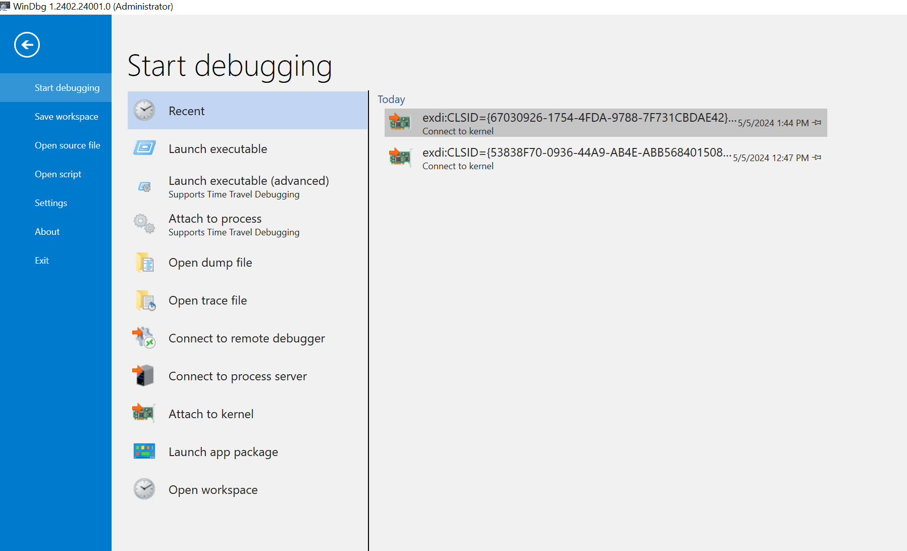
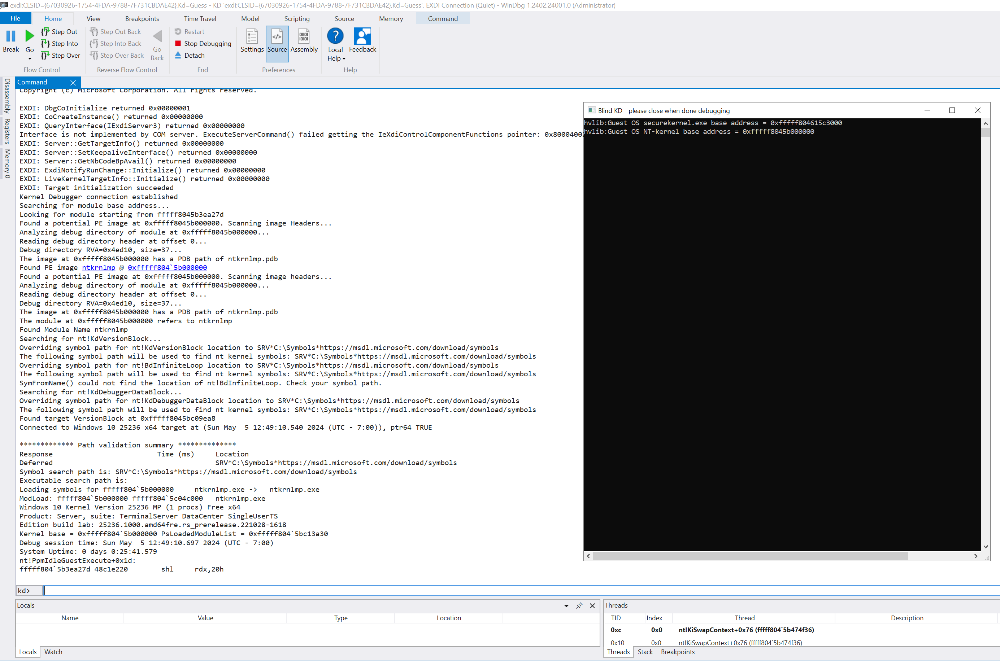
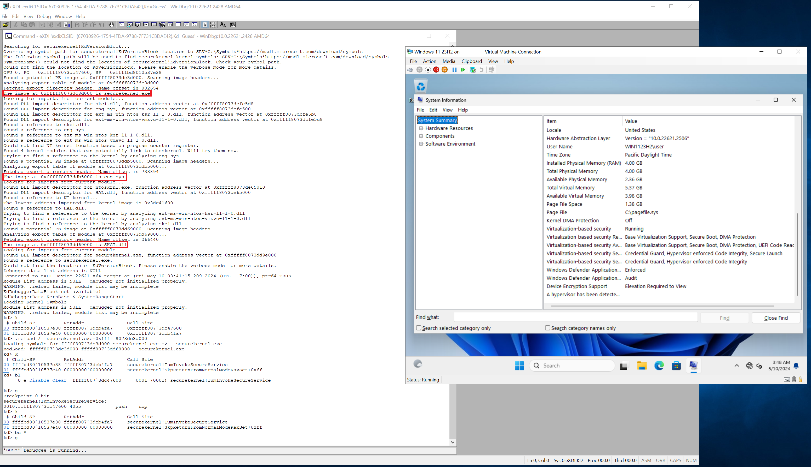

# Hyper-V live debugging

[Actual distributive](https://github.com/gerhart01/LiveCloudKd/releases/download/v1.0.22021109/LiveCloudKd.EXDi.debugger.v1.0.22021109.zip)

LiveCloudKd EXDi debugger can be used for debugging Hyper-V guest OS without enable kernel debugging in Windows bootloader.

It can be useful for debug Hyper-V VM with VBS and HVCI enabled.

Working with guest Windows Server 2022 and Windows 11, including preview builds (on November 2022)

For debugging you need to use Windows Server 2019 (with August 2020 updates - Windows image name en_windows_server_2019_updated_aug_2020_x64_dvd_f4bab427.iso).
It is good to use VMware Workstation for itm but you can try use Hyper-V with Windows Server 2019 as guest OS and Windows 11 as nested guest OS.

# VSM\VBS activating for securekernel debugging

First read official Microsoft document [Enable virtualization-based protection or code integrity](https://docs.microsoft.com/en-us/windows/security/threat-protection/device-guard/enable-virtualization-based-protection-of-code-integrity)

It was enough to enable VBS in group policy editor.

For guest VM don't forget enable SecureBoot option with TPM support (for Windows 11). 

Check
```
Get-VMSecurity -VMName <VMName>
```
output. VirtualizationBasedSecurityOptOut must be $false
	
Don't enable nested virtualization support for guest OS. VBS in guest Hyper-V VM works without guest hypervisor.

# Installation

EXDi is used for integration custom debugging engines with WinDBG.

LiveCloudKDExdi plugin in live debugging mode works with Hyper-V on Windows Server 2019 and Windows 10 20H1 (19041) as host OS. Guest OS can be various. 

1. Extract all files to WinDBG x64 10.0.22621 install directory (installer can be found in Windows SDK 11 22H2) or WinDBG with modern UI (ex. Preview)
2. Install Visual Studio 2022 runtime libraries - https://aka.ms/vs/17/release/vc_redist.x64.exe 
3. Register ExdiKdSample.dll using
   ```
   regsvr32.exe ExdiKdSample.dll
   ```
   command
4. Don't forget configure symbols path for WinDBG as usual:

```
mkdir C:\Symbols
compact /c /i /q /s:C:\Symbols
setx /m _NT_SYMBOL_PATH SRV*C:\Symbols*https://msdl.microsoft.com/download/symbols
```

# Start

1. Set "VSMScan"=dword:00000001 for securekernel scanning or "VSMScan"=dword:00000000 for ntoskrnl debugging (if it is needed) using RegParam.reg file
2. Start LiveCloudKd with EXDi plugin: 

```
LiveCloudKd /l /a 0 /n 0
```
a - Action ID (Live kernel debugger)
n - ID of virtual machine

It automatically launches WinDBG with EXDi plugin in live debugging mode.

3. You can use WinDBG and see events in separate logging window:


4. Also you can directly start WinDBG using command

```
windbg.exe -d -v -kx exdi:CLSID={67030926-1754-4FDA-9788-7F731CBDAE42},Kd=Guess
```

but before you need create registry key HKEY_LOCAL_MACHINE\SOFTWARE\LiveCloudKd\Parameters\VmId, type REG_DWORD and enter VM position number in LiveCloudKd list [0, 1, 2, ...]. You can see that list, if you launch LiveCloudKd without parameters. If you launch 1 VM, that parameter will be 0.

5. You can use EXDi plugin in WinDBG with modern UI too. Some versions of WinDBG Preview have bug to auto starting EXDi plugin from command line, therefore it must be start manually (through EXDi connection string). But latest versions (1.2402.24001.0) work without that errors.

6. Now you can start WinDBG with modern UI, then go to File-Start debugging-Attach to Kernel, open EXDi tab and paste string 

```
CLSID={67030926-1754-4FDA-9788-7F731CBDAE42},Kd=Guess
```

or for latest versions you need to create KernelConnect<some_number>.debugTarget file (for example KernelConnect0213466621.debugTarget) in C:\Users\UserName\AppData\Local\DBG\Targets

```xml
<?xml version="1.0" encoding="utf-8"?>
<TargetConfig Name="exdi:CLSID={67030926-1754-4FDA-9788-7F731CBDAE42},Kd=Guess" LastUsed="2024-05-05T19:27:57.9745641Z">
  <EngineConfig />
  <EngineOptions>
    <Property name="InitialBreak" value="true" />
    <Property name="Elevate" value="false" />
  </EngineOptions>
  <TargetOptions>
    <Option name="KernelConnect">
      <Property name="ConnectionString" value="exdi:CLSID={67030926-1754-4FDA-9788-7F731CBDAE42},Kd=Guess" />
      <Property name="ConnectionType" value="EXDI" />
      <Property name="QuietMode" value="false" />
      <Property name="InitialBreak" value="true" />
    </Option>
    <Option name="RestoreBreakpoints">
      <Property name="Breakpoints" />
    </Option>
    <Option name="RestoreCommandHistory">
      <Property name="History" />
    </Option>
  </TargetOptions>
</TargetConfig>
```
and start EXDi plugin from "Recent" option of debugger or launch it from command line (on latest versions)
```
DbgX.Shell.exe -v -kx exdi:CLSID={67030926-1754-4FDA-9788-7F731CBDAE42},Kd=Guess
```




# Live debugging usage

1 CPU for guest OS for live debugging is preferrable.
Experimented multi-CPU debugging was added. For successfull debugging you need set Debug-Event Filters->Break instruction exception to Handle->Not Handle, and Execution->Output inside WinDBG. 

Set breakpoint using "bp" command, press "Run", wait until breakpoint was triggered. You can set 0x1000 breakpoints now. It is software-like breakpoints and they are not limited. 
Also you can use single step command.

For debugging securekernel:

1. See securekernel.exe base address in logging output window
2. Execute command in WinDBG:

```
.reload /f securekernel.exe=<securekernel_base_address>
```

3. Make breakpoint (you need enter to securekernel context)

```
bp securekernel!IumInvokeSecureService
```

4. After bp was triggered, execute .reload command. In WinDBG with modern UI you need press Ctrl+Alt+V for enabling verbose mode (you can't to enable it from cmd line - Dbg.Shell.X doesn't get additional parameters, when it launching in EXDi mode).
Search images load addresses in pattern:

```
The image at <module_base_address> is securekernel.exe
The image at <module_base_address> is SKCI.dll
The image at <module_base_address> is cng.sys 

Also

Found DLL import descriptor for ext-ms-win-ntos-ksr-l1-1-0.dll, function address vector at 0xfffff8068882c5c8
Found DLL import descriptor for ext-ms-win-ntos-vmsvc-l1-1-0.dll, function address vector at 0xfffff8068882c5d8
```



5. Reload symbols for all modules, that will be found by WinDBG:

```
.reload /f securekernel.exe=<module_base_address> - no need for WinDBGX
.reload /f SKCI.dll=<module_base_address>
.reload /f cng.sys=<module_base_address>
```

6. You can load standard address space modules using same commands even you inside securekernel context

```
.reload /f ntkrnlmp.exe=<module_base_address>
```

7. Use script [securekernel_info_pykd.py](https://github.com/gerhart01/Hyper-V-scripts/blob/master/securekernel_info_pykd.py) for demo.

Also you can see demo video on youtube:

1. Debugging Hyper-V Windows Server 2019 guest OS using LiveCloudKd EXDI plugin - https://youtu.be/_8rQwB-ESlk
2. Microsoft Windows Server 2019 securekernel live debugging using WinDBG EXDi LiveCloudKd plugin - https://youtu.be/tRLQwsJQ-hU
3. Debugging Windows 11 25140 guest OS using LiveCloudKd EXDI plugin - https://www.youtube.com/watch?v=0VIVc0IsfRk

# Settings

There are some settings can be configured through Windows Registry (see file RegParam.reg in distributive). Path HKEY_LOCAL_MACHINE\SOFTWARE\LiveCloudKd\Parameters

1. VSMScan - enable VSM scanning for guest OS
2. UseDebugApiStopProcess parameter enables DebugActiveProcess\DebugActiveProcessStop functions

# Remarks

1. If you close debugger or his part (WinDBG, output windows, or corresponding dllhost.exe process), virtual machine can stay in the suspended state. 
	For resuming it without reset, start LiveCloudKd with /p option, select VM from list and then select 
	
```
	4 - Resume partition.
```
	
NtSuspendProcess and NtResumeProcess are using for manage of state vmwp.exe process. It is not need for Windows Server 2019 (stopping of virtual cpus is enough), but need for Windows 10 host OS (because of difference in CPU scheduler). If something wrong, process can be resuming using Process Explorer from Sysinternals Suite. I recommend to use Windows Server 2019
	
2. Securekernel debugging in EXDi mode is unexplored feature, there are many problems can be triggered in debugging process, so first make test (you can see example on early mentioned video):

```
bp securekernel!IumAllocateSystemHeap
bp securekernel!IumInvokeSecureService
```

then press F5 (Go command) in WinDBG or WinDBGX, if bp was triggered, repeat it. If it will be successfull, try make simple tracing in securekernel using:

```
bp securekernel!IumAllocateSystemHeap "r rcx;g"
```
command

3. Sometimes (not often) WinDBG can suddenly break in random code, as a usual debugging. It can be caused by some other exceptions during debugging. When this exceptions occure, you don't get "breakpoint # hit" message.


4. You can switch register's context to VTL1, using "wrmsr 0x1111 1" command. "wrmsr 0x1111 0" switch back to VTL0. VTL0 and VTL1 memory is accessible all time.
5. If you want restart VM, but Hyper-V shows error about existing partition, see, that LiveCloudKd and WinDBG console message windows are closed. LiveCloudKd duplicates some handles from vmwp.exe. Also you can manually unload debugger driver, if you kill WinDBG process, because some interception messages will be handled by driver.

```
net stop hvmm
```
