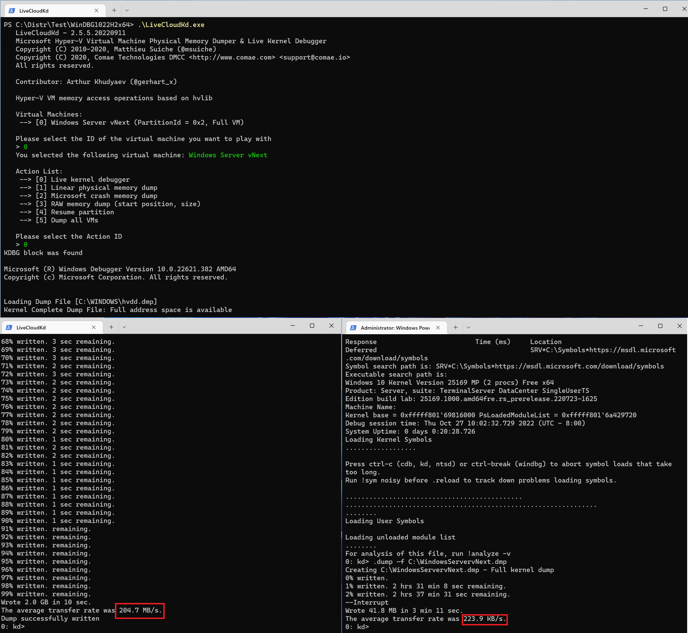

This is fork of LiveCloudKd early developed by Matt Suiche [@msuiche](https://www.twitter.com/msuiche) - https://github.com/msuiche/LiveCloudKd

## LiveCloudKd (2022).

LiveCloudKd is tool, that allows you connect to Hyper-V guest VM with kd.exe (or WinDBG.exe and WinDBG with modern UI (ex. WinDBG Preview) using EXDi plugin).
Tool uses Hyper-V memory manager plugin for operations with Hyper-V memory.

Tool has additional options in compare with LiveKd from Sysinternals Suite:

1. Write capabilities (you can write to Hyper-V VM in virtual and physical address space using native WinDBG Commands)
2. More performance.
3. Support Hyper-V VM with nested option enabled on Intel based CPU
4. Support multilanguage OS.

LiveCloudKd. [Download](https://github.com/gerhart01/LiveCloudKd/releases/download/v2.5.5.20220911/LiveCloudKd.v2.5.5.20220911-release.zip)     
Hyper-V Virtual Machine plugin for MemProcFS. [Download](https://github.com/gerhart01/LiveCloudKd/releases/download/v2.5.5.20220914/leechcore_hyperv_plugin_14.09.2022.zip)  
Hyper-V Memory Manager plugin for volatility. [Download](https://github.com/gerhart01/Hyper-V-Tools/releases/download/1.0.20221109/Hyper-V.Memory.Manager.plugin.for.volatility.v1.0.20221109.zip)  

Methods for accessing guest Hyper-V VM Memory: 

	ReadInterfaceWinHv - uses Hyper-V hypercall for reading guest OS memory. Slow, but robust method; 
	ReadInterfaceHvmmDrvInternal - read data directly from kernel memory. Faster, then ReadInterfaceWinHv, but uses undocument structures). See description of -m option. Default reading method is ReadInterfaceHvmmDrvInternal.
	
	WriteInterfaceWinHv - uses Hyper-V hypercall for writing to guest OS memory.
	WriteInterfaceHvmmDrvInternal - write data directly to kernel memory. Faster, then WriteInterfaceWinHv, but uses undocument structures). See description of -m option. Default writing method is WriteInterfaceHvmmDrvInternal.
	

Tested on full Windows Server 2016, Windows Server 2019, Windows Server 2022, Windows 10 and Windows 11 virtual machines

Configure symbol path:

``` 
mkdir C:\Symbols
compact /c /i /q /s:C:\Symbols
setx /m _NT_SYMBOL_PATH SRV*C:\Symbols*https://msdl.microsoft.com/download/symbols
```

For launch:

1. Place LiveCloudKd.exe, hvlib.dll, hvmm.sys to WinDBG x64 folder (tested on WinDBG from WDK 1809 - 22H2).
2. Launch LiveCloudKd.exe with admin rights (It needs Visual Studio 2022 runtime libraries - https://aka.ms/vs/17/release/vc_redist.x64.exe).
3. Choose virtual machine (Full VM only) for inspection.  

Performance comparison with LiveKd from Sysinternals Suite, at the time of release (LiveCloudKd is more performanced about 1000 times using ReadInterfaceHvmmDrvInternal interface):



Project uses diStorm3 library (BSD license) by [Gil Dabah](https://twitter.com/_arkon): [Distorm project](https://github.com/gdabah/distorm)
