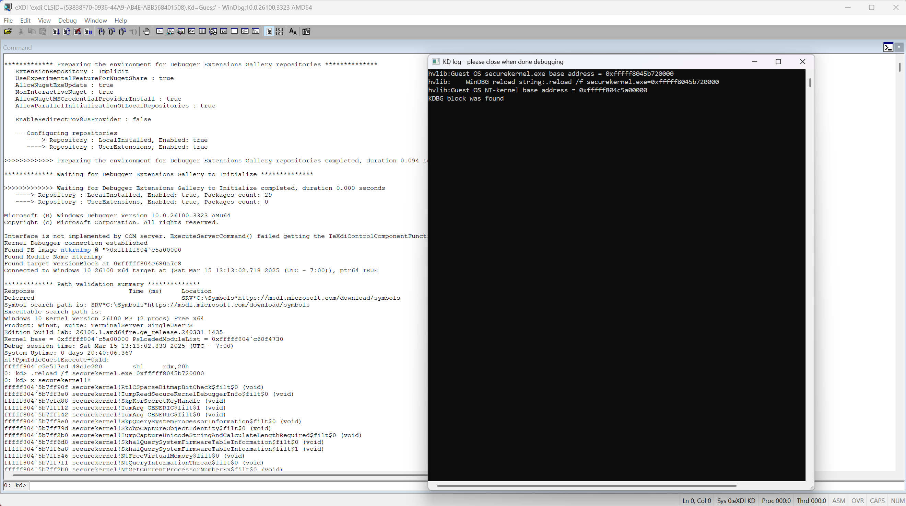

This is fork of LiveCloudKd, early developed by Matt Suiche [(www.msuiche.com)](https://www.msuiche.com): https://github.com/msuiche/LiveCloudKd.

## LiveCloudKd (2024)

LiveCloudKd is tool, that allows you connect to Hyper-V guest VM with kd.exe (or WinDBG.exe and WinDBG with modern UI). 

Also you can use LiveCloudKd EXDi plugin for attaching to Hyper-V VM.  

Tool uses Hyper-V Memory Manager plugin for operations with Hyper-V memory.
Tool has additional options in compare with LiveKd from Microsoft Sysinternals Suite:

1. Write capabilities (you can write to Hyper-V VM in virtual and physical address space using native WinDBG commands)
2. More performance
3. Support Hyper-V VM with nested option enabled on Intel based CPU
4. Support multilanguage OS

LiveCloudKd. [Download](https://github.com/gerhart01/LiveCloudKd/releases/download/v2.6.1.20240228/LiveCloudKd.v2.6.1.20240228-release.zip)  
Contains EXDi plugin:  




LiveCloudKd based on hvlib.dll library (Hyper-V memory manager plugin). Other tools, that were developed using this library:

LiveCloudKd EXDi debugger. [Download](https://github.com/gerhart01/LiveCloudKd/releases/download/v1.0.22021109/LiveCloudKd.EXDi.debugger.v1.0.22021109.zip). [Readme](https://github.com/gerhart01/LiveCloudKd/blob/master/ExdiKdSample/LiveDebugging.md)    
Hyper-V Virtual Machine plugin for MemProcFS. [Download](https://github.com/gerhart01/LiveCloudKd/releases/download/v1.2.20240228/leechcore_hyperv_plugin_28.02.2024.zip)  
Hyper-V Memory Manager plugin for volatility. [Download](https://github.com/gerhart01/Hyper-V-Tools/releases/download/1.0.20221109/Hyper-V.Memory.Manager.plugin.for.volatility.v1.0.20221109.zip)  

Methods for accessing guest Hyper-V VM memory: 

	ReadInterfaceWinHv - uses Hyper-V hypercall for reading guest OS memory. Slow, but robust method; 
	ReadInterfaceHvmmDrvInternal - read data directly from kernel memory. Faster, then ReadInterfaceWinHv, but uses undocument structures). See description of -m option. Default reading method is ReadInterfaceHvmmDrvInternal.
	
	WriteInterfaceWinHv - uses Hyper-V hypercall for writing to guest OS memory.
	WriteInterfaceHvmmDrvInternal - write data directly to kernel memory. Faster, then WriteInterfaceWinHv, but uses undocument structures). See description of -m option. Default writing method is WriteInterfaceHvmmDrvInternal.
	

LiveCloudKd was tested on Windows Server 2016, Windows Server 2019, Windows Server 2022, Windows 10 and Windows 11 operations system (some of preview versions of Windows 11 and Windows Server vNext including Windows Server 2025)

Configure symbol path:

``` 
mkdir C:\Symbols
compact /c /i /q /s:C:\Symbols
setx /m _NT_SYMBOL_PATH SRV*C:\Symbols*https://msdl.microsoft.com/download/symbols
```

For launch:

1. Extract LiveCloudKd.exe, hvlib.dll, hvmm.sys to WinDBG x64 folder (tested on WinDBG from WDK 1809 - 23H2) or separate folder (use /y key for specify directory with WinDBG). 
   Also LiveCloudKd can find path to WinDBG, if it was installed with Windows WDK or SDK
2. Launch LiveCloudKd.exe with admin rights (It needs Visual Studio 2022 runtime libraries - https://aka.ms/vs/17/release/vc_redist.x64.exe).
3. Choose Hyper-V virtual machine for inspection.  

When starting LiveCloudKd searches WinDBG in next steps:

1. Standard Windows SDK installation folder (using registry key)
2. in Windows Registry HKLM\Software\LiveCloudKd\Parameters in WinDbgPath key. See RegParam.key for examples. 
3. Set /y parameter with WinDBG path, for examples: 

```
LiveCloudKd /y C:\Microsoft\WinDBG
```

4. If previous result is not successful, LiveCloudKd tries to run kd.exe from same folder.

Performance comparison with LiveKd from Sysinternals Suite, at the time of release (LiveCloudKd is more performance: about 1000 times using ReadInterfaceHvmmDrvInternal interface):


LiveCloudKd options:

``` 
      /a        Pre-selected action.
                   0 - Live kernel debugging
                   1 - Start EXDi plugin (WinDBG)
                   2 - Produce a linear physical memory dump
                   3 - Produce a Microsoft full memory crash dump
                   4 - Dump guest OS memory chunk
                   5 - Dump RAW guest OS memory (without KDBG scanning)
                   6 - Resume VM
      /b        Close LiveCloudKd automatically, after exiting from kd or WinDBG.
      /f        Force freeze CPU on every read operations. It is actual for Windows Sandbox, because it constantly resume CPU.
      /m        Memory access type.
                   0 - Winhvr.sys interface
                   1 - Raw memory interface (hvmm.sys)
      /n        Pre-selected number of VM.
      /o        Destination path for the output file (Action 1 - 5).
      /p        Pause partition.
      /v        Verbose output.
      /w        Run Windbg instead of Kd (Kd is the default).
      /y        Set path to WinDBG or WinDBG with modern UI (for start EXDi plugin)
      /?        Print this help.
``` 

Project uses diStorm3 library (BSD license) by [Gil Dabah](https://twitter.com/_arkon): [Distorm project](https://github.com/gdabah/distorm)
